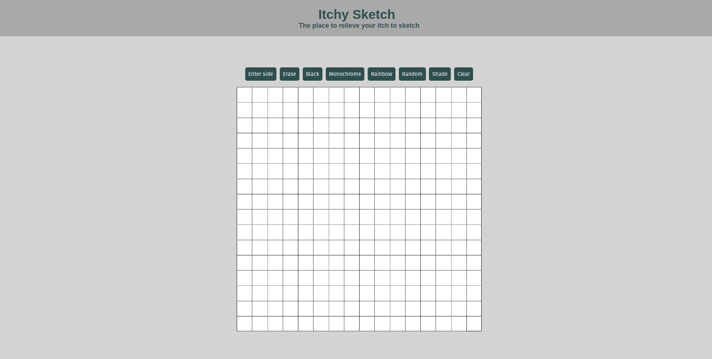
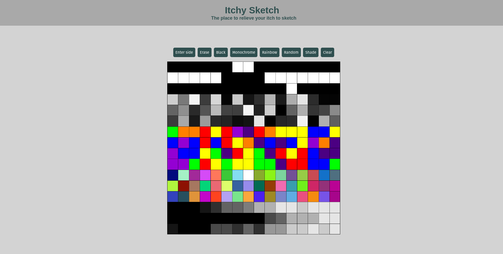

# The Odin Project - Etch-A-Sketch Project

This is my submission to the Etch-A-Sketch project of The Odin Project (https://www.theodinproject.com/lessons/foundations-etch-a-sketch)

## Table of contents

- [Overview](#overview)
  - [The challenge](#the-challenge)
  - [Screenshot](#screenshot)
  - [Links](#links)
- [My process](#my-process)
  - [Built with](#built-with)
  - [What I learned](#what-i-learned)
  - [Continued development](#continued-development)
  - [Useful resources](#useful-resources)

## Overview

### The challenge

Build a browser version of something between a sketchpad and an Etch-A-Sketch.

### Screenshots

### Links

- Solution URL: [https://github.com/wmartyr/etch-a-sketch](https://github.com/wmartyr/etch-a-sketch)
- Live Site URL: [https://wmartyr.github.io/etch-a-sketch/](https://wmartyr.github.io/etch-a-sketch/)

## My process

### Built with

- HTML5 markup
- CSS custom properties
- Flexbox

### What I learned

I learned a lot about DOM manipulation, events, and color changes

### Continued development

I definitely need more practice with DOM manipulations as this took me several hours over a few days to complete.

### Useful resources

- [https://www.w3schools.com/](https://www.w3schools.com/) - This site was a massive resource to get me over the line.
- [https://stackoverflow.com](https://stackoverflow.com) - I can't count how many times I have referenced this site.
